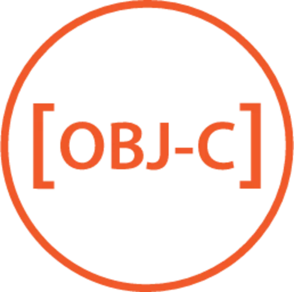

# 👋 Hi, I'm Mohamed Boghdaddy

**Full-Stack AI Engineer**  
I specialize in combining **Artificial Intelligence** with **Full-Stack Development** to build powerful, scalable applications that solve real-world problems. With a strong foundation in AI, web development, and mobile development, I am always exploring new technologies to continuously improve and deliver impactful projects. I have experience building AI models, integrating antivirus solutions, and developing mobile apps.

  
  

---

## 📈 GitHub Activity & Stats
  
  
  

---

## About Me

🎓 **Education**  
- **Computer Science**, Misr International University (2021 - Present), Cairo, Egypt

💼 **Experience**  
- **Machine Learning Engineer** at Neorontrix (2024)
- **Full-Stack MERN Intern** at ATOS (2024)
- **Software Developer Intern** at Relief and Emergency Foundation (2024)
- **Machine Learning Intern** at Code Alpha (2024)
- **Web Development Intern** at Prodigy Info Tech (2024)

🔧 **Skills**  
- **Programming Languages:** JavaScript, Python, C++, TypeScript, Objective-C, SQL, PHP  
- **Frameworks & Libraries:** Next.js, React Native, MERN Stack, MEAN Stack, Express, React, Node.js  
- **AI & Data Science:** Python AI Models, Machine Learning, Neural Networks, Deep Learning  
- **Mobile Development:** React Native, Objective-C  
- **Tools & Methodologies:** Git, Docker, Kubernetes, Antivirus Solutions, Agile, Microservices

Here’s a **merged, optimized, and elegant** version of your **Languages, Tools, and Frameworks** section, removing redundancy while maintaining a structured and visually appealing format.

---

## 💡 **Languages, Frameworks & Tools**  

### **Programming Languages**  

  
  
  
  
  
  
  
 

---

### **Frameworks & Libraries**  

  
  
  
  
  
  
  

---

### **Tools & DevOps**  

  
  
  
  
  
  

🔹 **Version Control:** Git, GitHub, GitLab  
🔹 **Cloud & Deployment:** Firebase, Netlify, Vercel, Heroku  
🔹 **Database Management:** MongoDB, PostgreSQL, MySQL  
🔹 **Cybersecurity:** Antivirus Development, Network Security  
🔹 **Methodologies:** Agile, Microservices Architecture  

---

### **Cybersecurity & Specialization**  
- **Antivirus Development:** Enhancing cybersecurity for applications.  
- **Containerization & Orchestration:** Docker & Kubernetes for scalable deployments.  
- **Machine Learning & AI:** Implementing AI-driven solutions in web and mobile applications.  

---

This **streamlined version** keeps only the best elements, maintains **high readability**, and **improves clarity** while keeping the layout **elite and professional**. 🚀

## Featured Projects

### 🚀 [HKI AI CAREER](https://github.com/MohamedBoghdaddy/hkiiapply)  
A full-stack MERN website powered by AI, designed to automate job applications, ensuring a seamless recruitment experience for users.

### 🚀 [DMS - Document Management System](https://github.com/MohamedBoghdaddy/Atos-Task-document-management-system)  
A robust MERN-based system for handling and organizing documents, similar to platforms like GitHub and Google Drive.

### 🚀 [HEDJ](https://github.com/MohamedBoghdaddy/HEDJ)  
A full-stack website for a product design company, integrating content management and rich user interactions.

### 🚀 [Petzone](https://github.com/MohamedBoghdaddy/Petzone)  
Frontend development for a veterinary website, with an emphasis on responsive design and user accessibility.

---

## Achievements & Interests

### 🏆 Achievements  
- **Competitive Programming:** Active participant in ACPC MIU Competitive Programming contests.  
- **Research:** Published research on loan acceptance algorithms using machine learning techniques.

### 🎯 Interests  
- Exploring AI advancements  
- Mobile development (React Native & Objective-C)
- Full-Stack Web Applications
- Cybersecurity & antivirus development  
- Boxing  
- Cooking  
- Rugby  

---

## Connect with Me

📧 **Email:** [mohamedhammad3.142@gmail.com](mailto:mohamedhammad3.142@gmail.com)  
🌍 **Location:** Cairo, Egypt  

  
  

# 👋 Hi, I'm Mohamed Boghdaddy

**Full-Stack AI Engineer**  
I specialize in combining **Artificial Intelligence** with **Full-Stack Development** to build powerful, scalable applications that solve real-world problems. With a strong foundation in AI, web development, and mobile development, I am always exploring new technologies to continuously improve and deliver impactful projects. I have experience building AI models, integrating antivirus solutions, and developing mobile apps.

  
  

  

  

## About Me

🎓 **Education**  
- **Computer Science**, Misr International University (2021 - Present), Cairo, Egypt

🌽 **Experience**  
- **Machine Learning Engineer** at Neorontrix (2024)
- **Full-Stack MERN Intern** at ATOS (2024)
- **Software Developer Intern** at Relief and Emergency Foundation (2024)
- **Machine Learning Intern** at Code Alpha (2024)
- **Web Development Intern** at Prodigy Info Tech (2024)

---

## Connect with Me

📧 **Email:** [mohamedhammad3.142@gmail.com](mailto:mohamedhammad3.142@gmail.com)  
🌍 **Location:** Cairo, Egypt  

  
  

